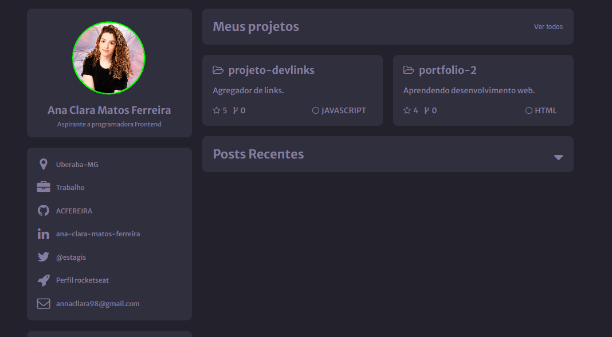

<h1 align="center"> Desafios Discover - Portfolio </h1>

Programa exclusivo e gratuito, promovido pela Rocketseat para ensino de tecnologias WEB.  
<a href="https://efficient-sloth-d85.notion.site/b0b109c64d0a4a8eb4de547de18fa04d?v=dd9d2f6b0f6542d69807f41312f4116d">Uma série de desafios do básicos ao avançado para que você possa praticar seus conhecimentos.</a>

  

## 🚀 Tecnologias

Esse projeto foi desenvolvido com as seguintes tecnologias:

- HTML
- CSS
- JavaScript
- Figma
- Git e Github

## 💻 Projeto

O desafio foi construir uma página web para que seja seu portfolio e currículo. Utilizando HTML e CSS. 

**Requisitos para o desafio:**
- Os cards dos projetos deverão ser clicáveis;
- Os cards dos posts deverão ser clicláveis;
- Design responsivo;
- Adicionar `hover` nos botões;

**Diferencial do meu projeto:**
- Utilização de JavaScrip;
- No card "Meus projetos" ao clicar em ver todos abre um "menu" com os projetos que já relizei;
- Transição entre um ícone e outro nos botões quando aberto um card;
- Transição de cor para identificar links;
-No card "Posts Recentes" ao clicar no botão abre um "post";